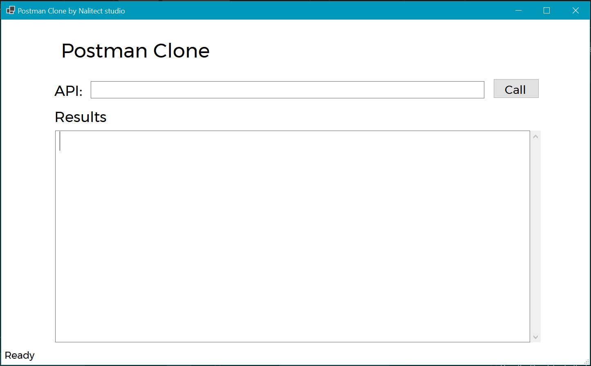

# Postman Clone App

Postman Clone provides a user-friendly interface for making GET requests to APIs and viewing results in formatted JSON. Ideal for Developers and testers, this tool simplifies API interraction and debugging, helping you efficiently validate and trouble shpot your API calls

## Technologies Used

* C#
* .NET 8
* HttpClient
* WinForms

## Using the App
1. Download the executable file from the release section.
2. When the App Launches, It should look like this:

3. Fill in your API Url and press Call

4. Hire Me!

## Upcoming Changes
* Adding POST, PUT, PATCH, and DELETE functionality
* Adding API Headers
* Handling API Authorization
* Adding Dependency Injection
* Adding Logging
* Create a web-based UI for the application
